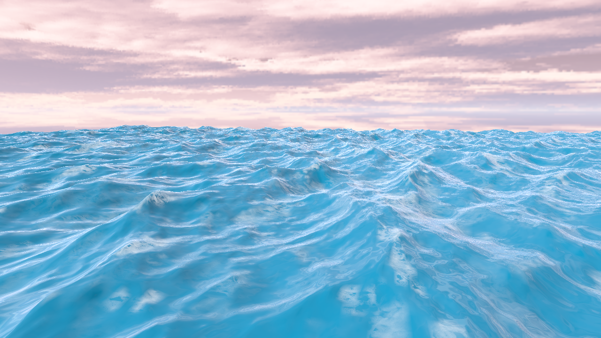

# FFT Ocean Simulation

> Real-time ocean surface simulation using the Fast Fourier Transform, built with WebGPU (C++).
> Developed as a **bachelor's thesis** project.



---

## Overview

This project implements a physically-based, real-time ocean surface simulation running entirely on the GPU via compute and render shaders written in WGSL. It is built with **C++23** and the **WebGPU** graphics API, targeting both native desktop (wgpu-native / Dawn backends) and the web via Emscripten. The ocean model is based on the statistical JONSWAP wave spectrum evolved over time using a GPU-accelerated 2D Inverse Fast Fourier Transform.

---

## How It Works

### 1 — Initial Spectrum Generation `h₀(k)`

At startup the CPU generates a statistical wave spectrum **h₀(k)** using the **JONSWAP directional model**. Each frequency component is seeded with a Gaussian random amplitude scaled by the spectral energy density, which depends on wind speed, fetch length, and the peak enhancement factor γ. The Hermitian symmetry condition `h₀(−k) = h₀*(k)` is enforced so the IFFT output remains real-valued.

### 2 — Time Evolution `time_spectrum.wgsl`

Each frame a compute shader evolves the spectrum:

```math
h(\mathbf{k}, t) = h₀(\mathbf{k})·e^{iωt} + h₀^*(−\mathbf{k})·e^{−iωt}
```

where `ω = √(gk)` is the deep-water dispersion relation. The same pass simultaneously computes the **slope spectra** (∂h/∂x, ∂h/∂y) and **choppy displacement spectra** (Dₓ, Dᵧ) in the frequency domain by multiplying by `ik`.

### 3 — 2D Inverse FFT `fft.wgsl`

The six frequency-domain textures are transformed to the spatial domain by a two-pass 2D IFFT: horizontal butterfly passes followed by vertical butterfly passes. The **Cooley-Tukey DIT** algorithm is used with a precomputed twiddle-factor lookup table stored in a texture. Results are written into ping-pong **RGBA32Float** textures each frame.

### 4 — Foam Accumulation `foam.wgsl`

A separate compute pass computes the full **2×2 Jacobian determinant** of the displacement field via central finite differences:

```math
J = (1 + λ·Jxx)(1 + λ·Jyy) − (λ·Jxy)²
```

Where `J < threshold`, wave crests are breaking and foam accumulates proportionally. A configurable erosion factor decays the foam field each frame, producing a natural fade-out between breaking events.

### 5 — Rendering `water.wgsl` + `skybox.wgsl`

The water surface is rendered as a **256×256 mesh tiled in a 3×3 grid** (9 GPU instances) for a seamless infinite-ocean appearance. Each frame:

- The **vertex shader** samples height, Dₓ, and Dᵧ textures to displace vertices in all three axes
- The **fragment shader** computes surface normals from slope textures, then evaluates:
  - Blinn-Phong diffuse + specular (directional sun)
  - **Schlick Fresnel** for view-dependent reflectivity
  - **Cubemap environment** sampling along the reflected view vector
  - **Foam blending** using the Jacobian-based foam mask and a tiling detail texture

The skybox is rendered in a single fullscreen triangle with depth `LessEqual` and no depth writes, filling the background after the water geometry.

### 6 — ImGui Controls

Runtime parameters are exposed through ImGui panels:

| Panel | Parameters |
| ----- | ---------- |
| **Ocean** | Choppiness (λ), patch size, wave amplitude, wind speed X/Y, fetch — plus a **Rebuild spectrum** button to regenerate h₀(k) after JONSWAP changes |
| **Foam** | Jacobian threshold, erosion rate, accumulation scale |

---

## Features

- 🌊 JONSWAP directional wave spectrum with configurable wind, fetch, and peak enhancement γ
- ⚡ GPU-accelerated 2D IFFT via Cooley-Tukey butterfly algorithm (16×16 workgroups)
- 🫧 Jacobian-determinant foam with proportional accumulation and exponential erosion
- 🌅 Cubemap skybox with Fresnel-based environment reflections
- 🧩 3×3 seamless tile instancing for an infinite-ocean appearance
- 🎛️ Real-time ImGui parameter panels with live feedback
- 🌐 Dual target: native desktop (wgpu-native / Dawn) and web (Emscripten / WebGPU)

---

## Build

### Native — wgpu-native backend

```bash
cmake -B build-wgpu -DWEBGPU_BACKEND=WGPU
cmake --build build-wgpu
```

### Native — Dawn backend

```bash
cmake -B build-dawn -DWEBGPU_BACKEND=DAWN
cmake --build build-dawn
```

### Web — Emscripten

```bash
emcmake cmake -B build-emscripten
cmake --build build-emscripten
```

---

## Sources

| Resource | Used for |
| -------- | -------- |
| [LearnWebGPU](https://eliemichel.github.io/LearnWebGPU/) — Elie Michel | WebGPU C++ setup, `webgpu-utils.h`, general API patterns |
| [WebGPU Fundamentals](https://webgpufundamentals.org) | WebGPU concepts and reference |
| [WebGPU Samples](https://webgpu.github.io/webgpu-samples/) | Shader and pipeline examples |
| [Emscripten](https://emscripten.org) | Web / WASM build toolchain |
| Jerry Tessendorf — *Simulating Ocean Water* (2001) | JONSWAP spectrum, FFT ocean model, Jacobian foam derivation |
